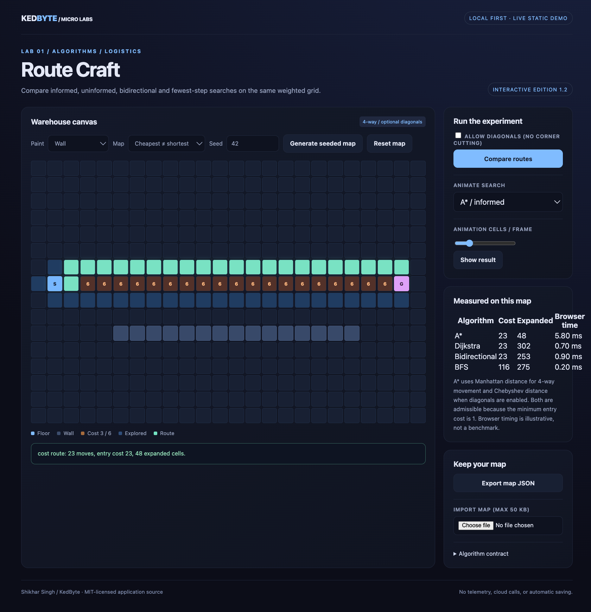

# Route Craft

Paint a warehouse. Compare cost-optimal routing with fewest-step routing. Watch the route emerge.



## Run locally

Python 3.10+ and a modern browser are sufficient. No package installation, API key, model download, camera or microphone is required.

```bash
python3 serve.py
```

The read-only server chooses a free `127.0.0.1` port and opens the application. Keep Terminal running; Ctrl+C stops it. Do not open `index.html` directly: ES modules (and the Merkle app's secure-context API) should be loaded through localhost or HTTPS.

## Use it

Choose a map and press **Compare routes**. A*, Dijkstra, and BFS run on the same map; choose one to animate its expanded cells. A* and Dijkstra minimize entry cost while BFS minimizes the number of grid moves. **Show result** completes the animation immediately. Paint by dragging. Use the tool selector to move the start/goal or add costs. The preset **Cheapest ≠ shortest** demonstrates a weighted detour. Export and import your map as JSON.

Keyboard: focus a cell, use arrow keys, then Enter/Space to paint. Reduced-motion preference skips the animation.

## Algorithm contract
Four orthogonal neighbours only. Zero means an impassable wall. Walkable entry costs are 1, 3, or 6; the starting cell costs zero. A* uses Manhattan distance with a minimum edge cost of 1. Dijkstra uses zero heuristic. BFS ignores weights while choosing a route, then reports the actual entry cost of the route it selected. The priority queue resolves equal priorities deterministically. The closed-cell list counts expanded cells, not elapsed CPU time. Bounds: 48 × 32 cells. Start and goal may be equal.

This is one start-to-goal search, not multi-stop vehicle routing, traffic prediction, or a warehouse digital twin. Changing a cell clears old results.

## Tests

Node.js 22+ is required only for tests, not for the browser application. No npm install is needed.

```bash
node --test tests/*.test.mjs
```

Source tests use Node's built-in test runner. See [validation](docs/VALIDATION.md) for the exact checks and browser-harness limits. An included CI workflow runs these tests; it is not a claim that remote Actions has run.

## Publish a live demo

This is a static site with relative URLs. After creating the public repository, set **Settings → Pages → Deploy from a branch → main → /(root) → Save**. No frontend build is required. See [GitHub's publishing-source documentation](https://docs.github.com/en/pages/getting-started-with-github-pages/configuring-a-publishing-source-for-your-github-pages-site). The localhost server's response-header policy is not automatically carried to static hosting.

## Privacy and scope

All application processing occurs in the browser. No external runtime requests, telemetry, accounts, automatic saving, localStorage, or service workers are used. Imported files are read by the browser, not posted to the server. Export is explicit; refresh clears the workspace. The Python server serves only `ASSETS.json` paths, not your home directory or `.git` folder. It is a development helper, not an internet-facing production server.

## Reference

Algorithm/API reference consulted: https://www.redblobgames.com/pathfinding/a-star/introduction.html
Implementation, interfaces, tests and sample content are original project code. Third-party runtimes retain their own licenses; see [THIRD_PARTY.md](THIRD_PARTY.md).

## License

MIT application source. Maintainer: Shikhar Singh.
